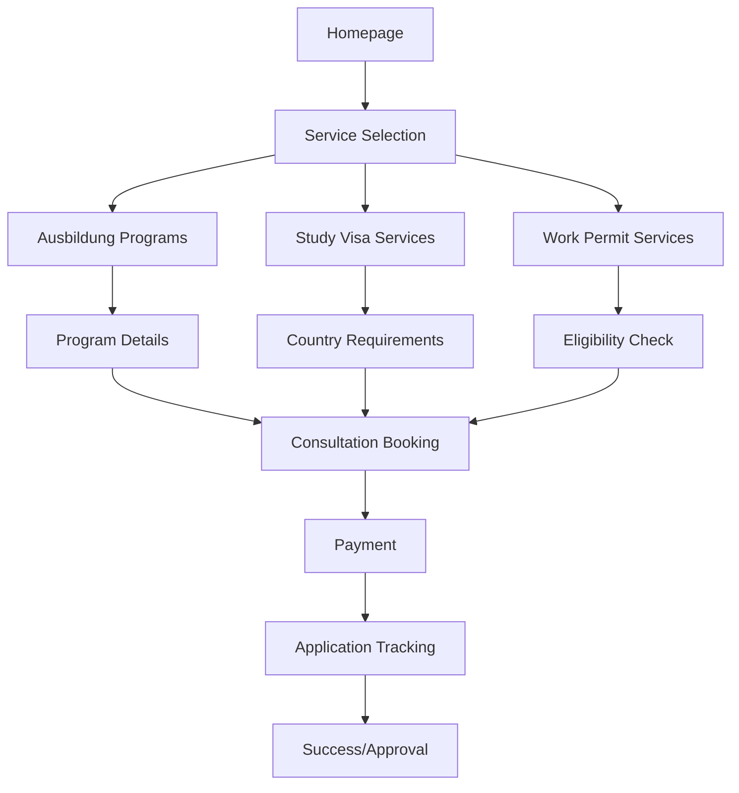

# AusbildungVisa - Product Requirements Document

## 1. Product Overview
AusbildungVisa is a comprehensive digital platform designed to assist Bangladeshi students and professionals in securing Ausbildung programs, study visas, and work permits for Germany and EU countries. The platform serves as a one-stop solution for visa processing, program selection, and consultation services.

The platform addresses the complex visa application process by providing expert guidance, comprehensive program listings, and personalized consultation services specifically tailored for Bangladeshi citizens seeking educational and professional opportunities in Europe.

## 2. Core Features

### 2.1 User Interaction
The website operates without user authentication or registration. All visitors have the same access level and can:
- Browse all programs and services information
- Access blog content and resources
- Submit contact forms and consultation requests
- Download available guides and resources
- Contact via phone or email for personalized assistance

### 2.2 Feature Module
Our AusbildungVisa platform consists of the following main pages:
1. **Homepage**: hero section with value proposition, service overview, success statistics, testimonials preview
2. **Ausbildung Programs**: comprehensive catalog of German vocational training programs, filtering and search functionality
3. **Study Visa Services**: EU country-specific study visa information, requirements, processing timelines
4. **Work Permit Services**: German work permit processing for Bangladeshi residents in Singapore, Malaysia, UAE
5. **About Us**: company information, team profiles, success stories, process overview
6. **Consultation Booking**: appointment scheduling, service packages, payment integration
7. **Blog & Resources**: visa guides, program updates, success stories, FAQ section
8. **Contact**: multiple contact methods, office locations, inquiry forms

### 2.3 Page Details
| Page Name | Module Name | Feature description |
|-----------|-------------|---------------------|
| Homepage | Hero Section | Display compelling value proposition with call-to-action buttons, showcase key statistics |
| Homepage | Services Overview | Present three main service categories with brief descriptions and navigation links |
| Homepage | Success Stories | Feature testimonials carousel with photos and success metrics |
| Homepage | Quick Contact | Embedded contact form for immediate inquiries |
| Ausbildung Programs | Program Catalog | List all German Ausbildung programs with detailed descriptions, requirements, duration |
| Ausbildung Programs | Search & Filter | Enable filtering by field, duration, location, language requirements |
| Ausbildung Programs | Program Details | Individual program pages with comprehensive information, application process |
| Study Visa Services | Country Selection | Display EU countries with study visa services, requirements comparison |
| Study Visa Services | Visa Requirements | Detailed checklists, document requirements, processing times for each country |
| Study Visa Services | Application Process | Step-by-step guidance, timeline tracking, document submission portal |
| Work Permit Services | Eligibility Check | Interactive form to verify eligibility based on current location and qualifications |
| Work Permit Services | Process Overview | Detailed workflow from application to approval, required documents |
| Work Permit Services | Success Rate Display | Statistics and testimonials specific to work permit applications |
| About Us | Company Profile | Mission, vision, team information, certifications and partnerships |
| About Us | Process Methodology | Detailed explanation of service delivery process, quality assurance |
| Consultation Booking | Contact Form | Comprehensive inquiry form with service type selection, contact preferences |
| Consultation Booking | Service Information | Detailed service descriptions, pricing information, process overview |
| Consultation Booking | Contact Methods | Multiple contact options (phone, email, WhatsApp), office hours display |
| Blog & Resources | Article Management | Categorized articles, search functionality, related content suggestions |
| Blog & Resources | Resource Downloads | Downloadable guides, checklists, application forms |
| Contact | Contact Information | Multiple contact methods, office locations with maps, social media links |
| Contact | Inquiry Forms | Categorized contact forms for different service types, auto-reply confirmation |
| Thank You | Confirmation Message | Form submission confirmation, next steps information, expected response time |
| Privacy Policy | Data Protection | Information handling policies, GDPR compliance, contact data usage |

## 3. Core Process

**General Visitor Flow:**
Visitors land on homepage → explore services → read blog content → submit contact form → receive email/phone consultation → get personalized guidance

**Study Visa Inquiry Flow:**
User browses study visa services → selects target EU country → reviews requirements → submits consultation request → receives detailed guidance via email/phone → gets application assistance

**Ausbildung Seeker Flow:**
User browses programs → filters by preferences → views program details → submits inquiry form → receives program recommendations via email/phone → gets application support

**Work Permit Inquiry Flow:**
User checks eligibility information → confirms current location (Singapore/Malaysia/UAE) → submits consultation request → receives eligibility confirmation and guidance via email/phone → gets application assistance

## 4. User Interface Design
### 4.1 Design Style
- **Primary Colors**: Deep Blue (#1E40AF) for trust and professionalism, Vibrant Orange (#F97316) for call-to-action elements
- **Secondary Colors**: Light Blue (#DBEAFE) for backgrounds, Green (#10B981) for success indicators
- **Button Style**: Rounded corners with subtle shadows, gradient effects for primary actions
- **Typography**: Inter font family, 16px base size, clear hierarchy with bold headings
- **Layout Style**: Card-based design with clean white backgrounds, generous spacing, top navigation with mega menu
- **Icons**: Outline style icons from Heroicons, consistent sizing and spacing

### 4.2 Page Design Overview
| Page Name | Module Name | UI Elements |
|-----------|-------------|-------------|
| Homepage | Hero Section | Full-width background image, centered content, large heading (48px), prominent CTA buttons with gradient effects |
| Homepage | Services Cards | Three-column grid layout, icon-text-button cards with hover animations, consistent spacing |
| Ausbildung Programs | Program Grid | Responsive card layout, image thumbnails, program titles, key details, filter sidebar |
| Study Visa Services | Country Cards | Flag icons, country names, processing time badges, requirements summary |
| Work Permit Services | Eligibility Form | Step-by-step form with progress indicator, conditional fields, validation messages |
| Consultation Booking | Calendar Widget | Interactive calendar, time slots, service selection dropdown, pricing display |
| Blog & Resources | Article Layout | Featured image, category tags, reading time, author info, social sharing buttons |

### 4.3 Responsiveness
The platform is mobile-first responsive with breakpoints at 640px, 768px, 1024px, and 1280px. Touch-optimized interactions for mobile devices, with larger tap targets and swipe gestures for carousels. Desktop version features expanded navigation and multi-column layouts for better content organization.