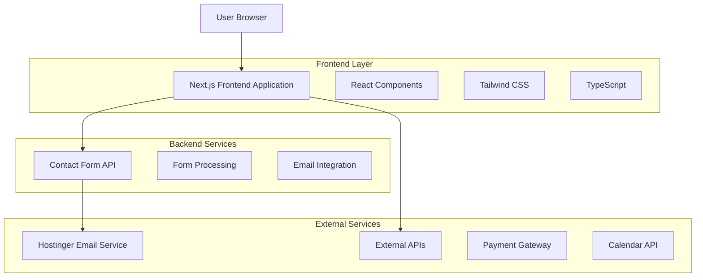
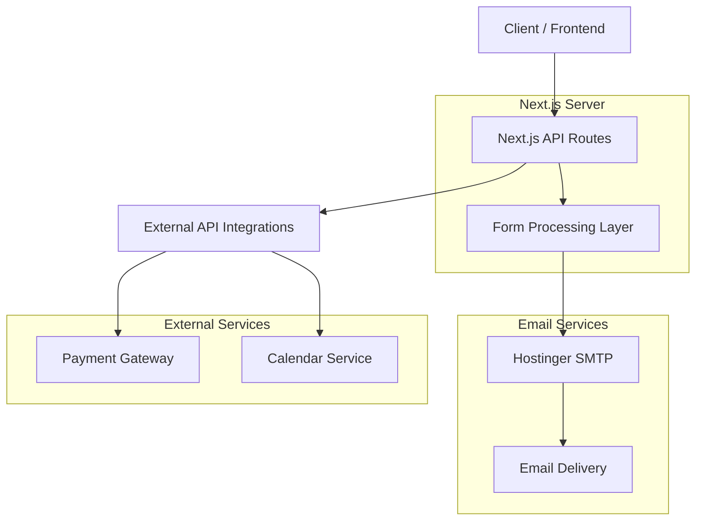

# AusbildungVisa - Technical Architecture Document

## 1. Architecture Design



## 2. Technology Description

- **Frontend**: Next.js@14 + React@18 + TypeScript@5 + Tailwind CSS@3 + Framer Motion@10
- **Backend**: Next.js API Routes + Nodemailer (Hostinger SMTP)
- **Build Tool**: Vite (integrated with Next.js)
- **Deployment**: Vercel
- **Additional Libraries**: React Hook Form, Zod validation, next-intl (internationalization), Nodemailer

## 3. Route Definitions

| Route | Purpose |
|-------|---------|
| / | Homepage with hero section, services overview, and testimonials |
| /ausbildung | Ausbildung programs catalog with search and filtering |
| /ausbildung/[slug] | Individual program detail pages |
| /study-visa | Study visa services for EU countries |
| /study-visa/[country] | Country-specific study visa information |
| /work-permit | Work permit services for Germany |
| /about | Company information and team profiles |
| /consultation | Consultation booking and service packages |
| /blog | Blog and resources section |
| /blog/[slug] | Individual blog post pages |
| /contact | Contact information and inquiry forms |
| /thank-you | Thank you page after form submission |
| /privacy-policy | Privacy policy and data handling information |

## 4. API Definitions

### 4.1 Core API

**Contact Form Submission**
```
POST /api/contact/submit
```

Request:
| Param Name | Param Type | isRequired | Description |
|------------|------------|------------|-------------|
| name | string | true | User's full name |
| email | string | true | Contact email address |
| phone | string | true | Mobile phone number |
| serviceType | string | true | Type of inquiry (ausbildung/study-visa/work-permit) |
| message | string | true | Detailed message or inquiry |
| preferredContact | string | false | Preferred contact method (email/phone) |

Response:
| Param Name | Param Type | Description |
|------------|------------|-------------|
| success | boolean | Submission status |
| message | string | Confirmation message |

**Consultation Request**
```
POST /api/consultation/request
```

Request:
| Param Name | Param Type | isRequired | Description |
|------------|------------|------------|-------------|
| name | string | true | User's full name |
| email | string | true | Contact email address |
| phone | string | true | Mobile phone number |
| serviceType | string | true | Type of consultation needed |
| currentLocation | string | false | Current country/city |
| educationLevel | string | false | Highest education level |
| preferredDate | string | false | Preferred consultation date |
| message | string | true | Specific requirements or questions |

Response:
| Param Name | Param Type | Description |
|------------|------------|-------------|
| success | boolean | Request submission status |
| referenceId | string | Reference ID for follow-up |

**Newsletter Subscription**
```
POST /api/newsletter/subscribe
```

Request:
| Param Name | Param Type | isRequired | Description |
|------------|------------|------------|-------------|
| email | string | true | Email address for subscription |
| name | string | false | Subscriber's name |
| interests | array | false | Areas of interest (ausbildung/study-visa/work-permit) |

Response:
| Param Name | Param Type | Description |
|------------|------------|-------------|
| success | boolean | Subscription status |
| message | string | Confirmation message |

## 5. Server Architecture Diagram



## 6. Content Management

### 6.1 Static Content Structure

The website uses a static content approach with the following structure:

```
/content/
├── programs/
│   ├── it-system-integration.md
│   ├── healthcare-assistant.md
│   └── automotive-mechatronics.md
├── blog/
│   ├── visa-guide-2025.md
│   ├── ausbildung-requirements.md
│   └── success-stories.md
├── countries/
│   ├── germany.md
│   ├── netherlands.md
│   └── austria.md
└── services/
    ├── ausbildung.md
    ├── study-visa.md
    └── work-permit.md
```

### 6.2 Content Schema

**Program Content (Markdown + Frontmatter)**
```yaml
---
title: "IT System Integration"
slug: "it-system-integration"
category: "Information Technology"
duration: "3 years"
location: "Berlin, Munich, Hamburg"
languageRequirement: "German B1"
requirements:
  - "High School Diploma"
  - "Under 25 preferred"
featured: true
---
```

**Blog Post Content**
```yaml
---
title: "Complete Guide to German Study Visa 2025"
slug: "german-study-visa-guide-2025"
category: "Study Visa"
author: "AusbildungVisa Team"
date: "2025-01-15"
featuredImage: "/images/study-visa-guide.jpg"
tags: ["study-visa", "germany", "requirements"]
---
```

### 6.3 Email Configuration

**Hostinger SMTP Configuration**
```javascript
// Email service configuration for Hostinger
const emailConfig = {
  host: 'smtp.hostinger.com',
  port: 587,
  secure: false, // true for 465, false for other ports
  auth: {
    user: process.env.HOSTINGER_EMAIL, // your-domain@yourdomain.com
    pass: process.env.HOSTINGER_PASSWORD
  }
};

// Email templates
const emailTemplates = {
  contactForm: {
    subject: 'New Contact Form Submission - AusbildungVisa',
    template: 'contact-form-template.html'
  },
  consultationRequest: {
    subject: 'New Consultation Request - AusbildungVisa',
    template: 'consultation-request-template.html'
  },
  autoReply: {
    subject: 'Thank you for contacting AusbildungVisa',
    template: 'auto-reply-template.html'
  }
};
```

**Sample Program Data (Static JSON)**
```json
{
  "programs": [
    {
      "id": "it-system-integration",
      "title": "IT System Integration",
      "category": "Information Technology",
      "duration": "3 years",
      "location": "Berlin, Munich, Hamburg",
      "languageRequirement": "German B1",
      "requirements": ["High School Diploma", "Under 25 preferred"],
      "description": "Comprehensive training in IT systems and network administration"
    },
    {
      "id": "healthcare-assistant",
      "title": "Healthcare Assistant",
      "category": "Healthcare",
      "duration": "3 years",
      "location": "Nationwide",
      "languageRequirement": "German B2",
      "requirements": ["High School Diploma", "Health Certificate"],
      "description": "Training for healthcare support roles in hospitals and clinics"
    }
  ]
}
```